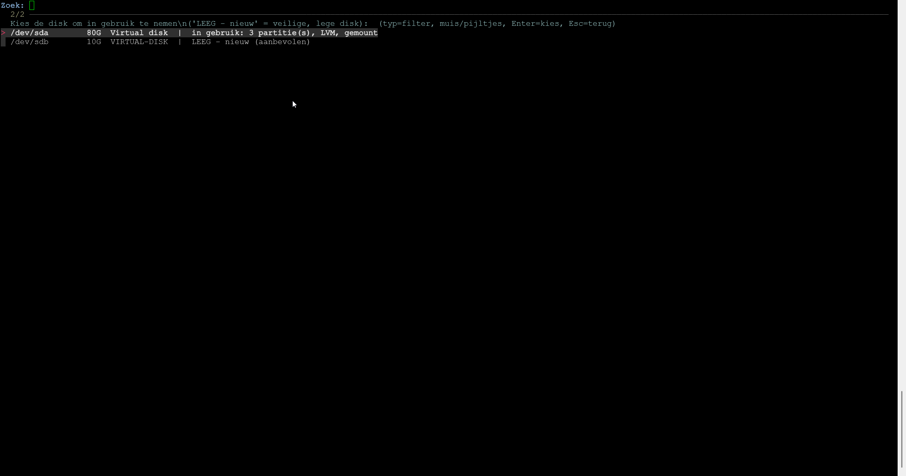
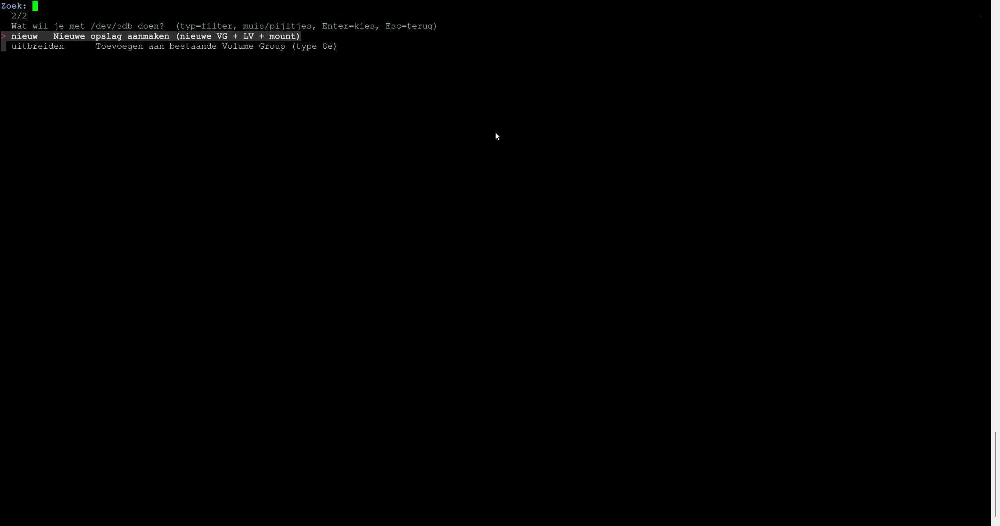
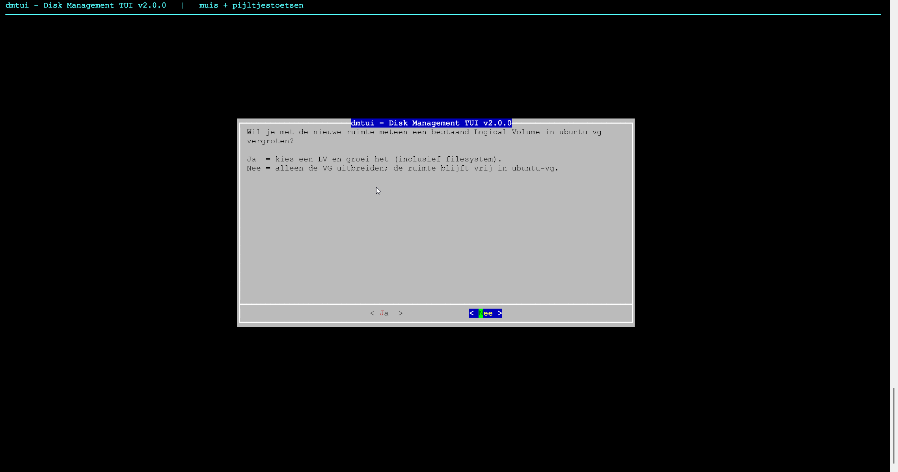

# dmtui — Disk Management TUI

[](https://github.com/aalhabeeb/dmtui/releases/latest)
[](https://github.com/aalhabeeb/dmtui/releases)
[](https://github.com/aalhabeeb/dmtui/blob/main/LICENSE)

**dmtui** is een terminalgebaseerde beheertool voor opslag op Linux. Het biedt een
overzichtelijke interface voor het partitioneren van schijven, het beheren van LVM
(Physical Volumes, Volume Groups en Logical Volumes), en het formatteren en mounten
van bestandssystemen — met een preview en bevestiging van elke bewerking.

Ondersteunde platformen: **RHEL, Rocky Linux, AlmaLinux** en **Ubuntu / Debian**.

Deze repository bevat de broncode (`dmtui.sh`), de packaging (`packaging/`) en de
gebouwde **`.deb`**- en **`.rpm`**-packages onder
[Releases](https://github.com/aalhabeeb/dmtui/releases).

## Schermafbeeldingen

### Hoofdmenu


### Nieuwe schijf in gebruik nemen


### Volume aanmaken


### Uitvoering en bevestiging


## Functionaliteit

- Schijven partitioneren met partitietype **8e (Linux LVM)**.
- Volledig LVM-beheer: Physical Volumes, Volume Groups en Logical Volumes aanmaken
  en uitbreiden.
- Begeleide wizard om een nieuwe schijf in gebruik te nemen: nieuwe opslag aanmaken
  óf toevoegen aan een bestaande Volume Group.
- Bestandssystemen formatteren (ext4/xfs/btrfs) en persistent mounten via `fstab`
  op UUID.
- Overzicht van de actuele opslag-layout (schijven, PV's, VG's, LV's).
- Bediening met **toetsenbord en muis**; met `fzf` filterbare lijsten (dubbelklik
  om te kiezen).

## Installatie

### Ubuntu / Debian (.deb)

```bash
url=$(curl -s https://api.github.com/repos/aalhabeeb/dmtui/releases/latest \
  | grep -o 'https://[^"]*_all\.deb')
curl -L -o dmtui.deb "$url"
sudo apt install ./dmtui.deb
```

### RHEL / Rocky / Alma (.rpm)

```bash
url=$(curl -s https://api.github.com/repos/aalhabeeb/dmtui/releases/latest \
  | grep -o 'https://[^"]*\.noarch\.rpm')
curl -L -o dmtui.rpm "$url"
sudo dnf install ./dmtui.rpm
```

De packages installeren automatisch de vereiste afhankelijkheden (`dialog`, `lvm2`,
`parted`, `util-linux`). Het optionele `fzf` (filterbare lijsten) wordt op
Debian/Ubuntu aanbevolen; op RHEL is het beschikbaar via EPEL.

Handmatig installeren kan ook: download het gewenste bestand van de
[nieuwste release](https://github.com/aalhabeeb/dmtui/releases/latest) en gebruik
`sudo apt install ./dmtui_*_all.deb` of `sudo dnf install ./dmtui-*.noarch.rpm`.

## Gebruik

dmtui vereist rootrechten:

```bash
sudo dmtui           # interactieve interface
dmtui --help         # help
dmtui --version      # versie
```

Elke destructieve bewerking toont vooraf een overzicht en vraagt om bevestiging.
De schijf met de root-mount (`/`) wordt automatisch gedetecteerd en beschermd.

## Updates

Er is nog geen APT/YUM-repository; updates worden dus niet automatisch via
`apt upgrade` / `dnf upgrade` opgehaald. Haal een nieuwe versie op via de
bovenstaande stappen en installeer deze over de bestaande installatie heen.

## Verwijderen

```bash
sudo apt remove dmtui    # Debian / Ubuntu
sudo dnf remove dmtui    # RHEL / Rocky / Alma
```

## Typische workflow — nieuwe extra disk toevoegen

1. **Layout tonen** → controleer de naam van de nieuwe disk (bijv. `/dev/sdb`).
2. **Partitie aanmaken (type 8e)** → kies `/dev/sdb`, GPT, grootte `100%`.
3. **Physical Volume aanmaken** → kies `/dev/sdb1`.
4. **Volume Group aanmaken** → kies het PV, naam bijv. `vg_data`.
5. **Logical Volume aanmaken** → kies `vg_data`, naam `lv_data`, grootte `100%FREE`.
6. **Formatteren + mounten** → kies `/dev/vg_data/lv_data`, `ext4`/`xfs`, mount `/mnt/data`.

Later uitbreiden met een tweede disk:

1. **Partitie aanmaken (8e)** op de nieuwe disk → **VG uitbreiden** (`vgextend`).
2. **LV uitbreiden** met `+100%FREE` en filesystem laten meegroeien.

Of de bestaande disk vergroten (bijv. `qm resize` in Proxmox):

1. **Disk vergroot? PV laten meegroeien** (menu-optie `g`) → dmtui laat de kernel
   de disk opnieuw inlezen, vergroot de partitie met `growpart` en draait `pvresize`.
2. **LV uitbreiden** met `+100%FREE`.

## Als pod op Kubernetes / Talos (TopoLVM)

Op een node zonder shell of package manager, zoals **Talos**, draait dmtui als
privileged pod. Het image `ghcr.io/aalhabeeb/dmtui` start automatisch in
**k8s-modus** (`DMTUI_MODE=k8s`). Die modus is bedoeld om een Volume Group
klaar te zetten voor [TopoLVM](https://github.com/topolvm/topolvm) en die later te
vergroten.

```bash
kubectl debug node/<node> -n kube-system -it --profile=sysadmin \
  --image=ghcr.io/aalhabeeb/dmtui:latest
# na afloop: kubectl -n kube-system delete pod <node-debugger-pod>
```

Of met het manifest [k8s/dmtui-pod.yaml](k8s/dmtui-pod.yaml) (vul eerst `nodeName` in):

```bash
kubectl apply -f k8s/dmtui-pod.yaml
kubectl -n kube-system exec -it dmtui -- dmtui
kubectl -n kube-system delete pod dmtui
```

Gebruik `kube-system`: die namespace is op Talos standaard vrijgesteld van Pod
Security. Elders heb je het label `pod-security.kubernetes.io/enforce=privileged` nodig.

**Wat de k8s-modus anders doet:**

- **Alleen PV + VG.** TopoLVM maakt per PVC zelf een LV aan, formatteert en mount
  het. Aanmaken of uitbreiden van LV's, formatteren en `fstab` zitten daarom niet in
  het menu.
- **Hele disk als PV** (`wipefs` → `pvcreate` → `vgcreate`/`vgextend`), zonder
  partitie. Groeien is dan alleen rescan + `pvresize`.
- **Strengere bescherming.** Disks met Talos-partities (`EFI`, `META`, `STATE`,
  `EPHEMERAL`, `IMAGECACHE`, `u-*`) en alles wat de node zelf gemount heeft
  (`/proc/1/mountinfo`, vereist `hostPID`) worden geweigerd.
- **Een VG met LV's kan niet verwijderd worden.** Die LV's zijn PVC's.
- **TopoLVM-config tonen** geeft de Helm-values (`lvmd.deviceClasses`) voor de
  gekozen VG.

**Later meer ruimte voor TopoLVM:**

| Situatie | In dmtui (pod op die node) |
|---|---|
| Disk vergroot in de hypervisor | **Disk vergroot? PV laten meegroeien** |
| Extra disk toegevoegd | **Wizard** → *Toevoegen aan bestaande Volume Group* |
| Eén PVC groter maken | niet in dmtui: vergroot `spec.resources.requests.storage` van de PVC |

TopoLVM ziet vrije ruimte in de VG vanzelf; er hoeft niets herstart te worden.

> [!WARNING]
> Maak VG-wijzigingen bij voorkeur als er geen PVC's worden aangemaakt. De
> LVM-locking van de dmtui-pod wordt niet gedeeld met TopoLVM's `lvmd`.

## Vanaf de broncode draaien

```bash
git clone https://github.com/aalhabeeb/dmtui.git
cd dmtui
sudo bash dmtui.sh
```

Ontbrekende vereisten (`dialog`, `lvm2`, `parted`, `util-linux`) worden dan
automatisch geïnstalleerd. `fzf` tijdelijk uitschakelen kan met
`DMTUI_NO_FZF=1 sudo dmtui`; debug-uitvoer met `DMTUI_DEBUG=1`.

## Zelf packages bouwen

De packages worden gebouwd met [nfpm](https://nfpm.goreleaser.com): één config
levert zowel `.deb` als `.rpm`. Op een Linux-host:

```bash
./packaging/build.sh          # bouwt beide in ./dist
./packaging/build.sh deb      # alleen .deb
./packaging/build.sh rpm      # alleen .rpm
```

Staat `nfpm` niet in `PATH`, dan downloadt het script automatisch een gepinde
versie naar `./bin`. Het resultaat (`<versie>` = `DMTUI_VERSION` uit `dmtui.sh`):

```text
dist/dmtui_<versie>_all.deb
dist/dmtui-<versie>-1.noarch.rpm
```

Het pakket installeert `dmtui` naar `/usr/bin/dmtui` en een manpage (`man 1 dmtui`).

## Releases (CI/CD)

De workflow [.github/workflows/release.yml](.github/workflows/release.yml):

- **Push naar `main` / pull request** → lint (`shellcheck`) + testbuild.
- **Push van een tag `v*`** → build **en** publiceert een GitHub Release in deze
  repo met de `.deb` en `.rpm`. De tag moet overeenkomen met `DMTUI_VERSION` in
  `dmtui.sh`, anders faalt de build.
- **Handmatige run** (workflow_dispatch) → build + upload als artefact.

Een release maken (vervang `X.Y.Z`):

```bash
# 1. Bump de versie in dmtui.sh (DMTUI_VERSION="X.Y.Z") en werk CHANGELOG.md bij
git commit -am "release: vX.Y.Z"
git tag vX.Y.Z
git push origin main --tags
```

## Beperkingen

- Richt zich op LVM + standaard filesystems; geen RAID/ZFS-beheer.
- Geen ondersteuning voor versleutelde volumes (LUKS) in deze versie.
- Bij een nieuw partitielabel (GPT/MBR) wordt de héle disk gewist.

## Waarschuwing

Opslagbewerkingen kunnen gegevens onherstelbaar wissen. Controleer altijd de
getoonde schijfnaam en het overzicht vóór bevestiging, en test bij voorkeur eerst
op een losse schijf of een test-VM.

## Licentie

Uitgebracht onder de [MIT-licentie](LICENSE). Wijzigingen per versie staan in
[CHANGELOG.md](CHANGELOG.md).
